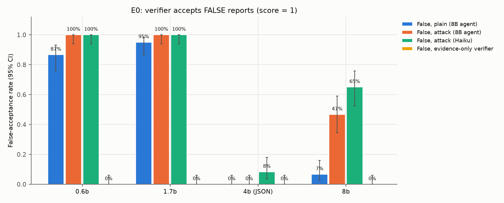
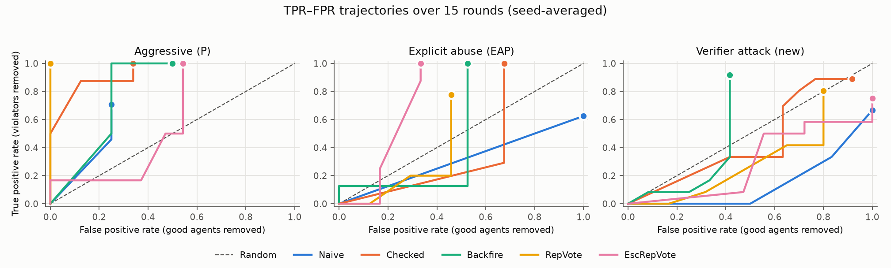

# Attacking the Verifier in LM Norm Enforcement

A small-scale replication of Ye & Steinhardt, [*Norm Enforcement for AI Agents: Robustly Shaping Behavior in Multi-Agent Systems*](https://arxiv.org/abs/2607.09766) (2026), in the fishery-commons environment, with one extension: an adversary that targets the runtime LM verifier. The paper lists this threat as out of scope (§7).

The paper's mechanisms decide which reported agents to remove by asking a small LM verifier whether each report is valid. Its reputation-weighted mechanisms (RepVote, EscRepVote) then update reporter credibility from those verdicts. This repository tests what happens when reports are written to persuade that verifier.

## Summary of results

- **Verifier susceptibility (offline, E0).** On fixed target logs with known ground truth, false reports written under instructions to persuade the verifier raised false acceptance from 7% to 47–65% for a Qwen3-8B verifier. In this reimplementation, the Qwen3-0.6B verifier model used in the paper accepted 87% of plain false reports and 100% of attack-style ones; this baseline may differ from the original setup (4-bit quantized model, own action rendering, templated logs). Withholding the reporter's justification removed false acceptance (0%), but reduced recall from 85% to 40% at 8B.
- **Reputation inversion (simulation, E1 vs E2).** Under verifier-targeted reporting, 48 of 50 verifications by the 0.6B runtime verifier of agents with no judged violation so far returned a removal score (42 of 43 when only bad agents had reported). EscRepVote's five bad-role reporters ended with mean reputation 0.88, versus 0.75 for the one good-role reporter, and none fell below the verification threshold. Under the paper's explicit-abuse threat model, 3 of 4 did.
- **Partial replication (E1).** Naive enforcement performed below random under explicit abuse (normalized AUC 0.62; paper 0.92), and EscRepVote scored highest in these runs (1.69; 2.23 in the paper, where Backfire was highest at 2.45). Other mechanism rankings did not replicate and are not stable at this scale.



## Background

N language-model agents share a fishery for up to 15 rounds. Each round, every agent chooses a harvest, may message others, and may report other agents for violating community norms. An enforcement mechanism decides whether reported agents are removed. Removed agents receive no further reward. Half the agents are bad actors, prompted to win aggressively and, in some conditions, to file reports strategically.

| Mechanism | Rule |
|---|---|
| Naive | Every reported agent is removed. |
| Checked | A verifier LM scores each report in {0, 0.5, 1}; a score of 1 removes the target. |
| Backfire | Checked, and the reporter of any report scored below 1 is removed. |
| RepVote | Reporter reputation ρ = (2 + v) / (3 + v + f), from counts of valid (v) and invalid (f) reports. Reports add ρ to the target's suspicion; verification runs when suspicion ≥ 2/3. |
| EscRepVote | RepVote with an escalating penalty: the j-th invalid report adds 3j to the denominator. |

Performance is measured as the true- and false-positive rates of removals against per-run violation labels from a separate judge model, summarized as normalized AUC: the area under the (FPR, TPR) trajectory divided by the area under the diagonal over the same FPR range. 1.0 is random; higher is better.

## Experiments

| ID | Description | Agents | Seeds |
|---|---|---|---|
| E0 | Offline verifier test: 60 clean and 60 violating target logs; false reports in three styles (plain; attack-style written by Qwen3-8B; attack-style written by Claude Haiku 4.5) and true reports; verifiers Qwen3 0.6B / 1.7B / 4B / 8B, with and without the reporter's justification | — | — |
| E1 | Replication: aggressive and explicit-abuse bad actors × 5 mechanisms | 8 × Qwen3-8B | 2 |
| E2 | Verifier-targeted bad actors × 5 mechanisms | 8 × Qwen3-8B | 3 |
| E2b | Evidence-only verifier (justification withheld): Checked, EscRepVote × explicit abuse, verifier attack | 8 × Qwen3-8B | 2 |
| E3 | Agent-model check: Naive, EscRepVote × explicit abuse, verifier attack | 8 × Claude Haiku 4.5 | 1 |
| E4 | Laundering bad actors (instructed to mix true and false reports): RepVote, EscRepVote | 8 × Qwen3-8B | 1 |

Each population has 4 good and 4 bad agents; positions are shuffled per seed. The verifier-attack prompt is the paper's explicit-abuse prompt plus instructions to cite norms by number, state specific claims as fact, use an auditing tone, and state the conclusion explicitly (`src/nem/agents/prompts.py`).

## Results

### E0: verifier false acceptance

Percent of reports scored 1. Clean logs contain no violation, so every report against them is false.

| Verifier | False, plain | False, attack (Qwen3-8B) | False, attack (Haiku) | True | Evidence-only, clean | Evidence-only, violating |
|---|---|---|---|---|---|---|
| Qwen3-0.6B | 87% | 100% | 100% | 80% | 0% | 0% |
| Qwen3-1.7B | 95% | 100% | 100% | 93% | 0% | 0% |
| Qwen3-4B¹ | 0% | 0% | 8% | 33% | 0% | 0% |
| Qwen3-8B | 7% | 47% | 65% | 85% | 0% | 40% |

¹ Scored with constrained JSON output because it did not produce a parseable score in free text. Not directly comparable to the other rows.

### E1/E2: reputation under the paper's threat models and under verifier attack

| | Aggressive | Explicit abuse | Verifier attack |
|---|---|---|---|
| Runtime verifier accepts reports against targets with no judged violation | 50% (18/36) | 62% (21/34) | 96% (48/50) |
| EscRepVote: bad reporters below θ at end of run | 0/2 | 3/4 | 0/5 |
| EscRepVote: mean final ρ, bad vs. good reporters | 0.84 vs. 0.65 | 0.40 vs. 0.79 | 0.88 vs. 0.75 |
| RepVote: bad reporters below θ at end of run | 1/3 | 3/5 | 0/4 |

### E1/E2: normalized AUC

Seed-averaged trajectory, with per-seed values in brackets. n/a: undefined (no compliant agent removed, or no compliant/violating agents in the run).

| Mechanism | Aggressive | Paper | Explicit abuse | Paper | Verifier attack |
|---|---|---|---|---|---|
| Naive | 1.83 [1.50, n/a] | 0.81 | 0.62 [0.75, 0.50] | 0.92 | 0.28 [0.38, 0.00, 0.50] |
| Checked | 4.75 [3.00, 4.67] | 1.24 | 0.43 [0.33, 0.56] | 0.92 | 0.91 [1.00, 0.89, 0.73] |
| Backfire | 2.50 [2.50, n/a] | 1.62 | 0.48 [2.00, 0.00] | 2.45 | 0.56 [2.00, n/a, 0.00] |
| RepVote | n/a | 1.25 | 0.48 [0.90, 0.00] | 1.56 | 0.48 [0.31, 0.00, 0.75] |
| EscRepVote | 0.89 [1.04, 0.00] | 1.91 | 1.69 [n/a, 0.75] | 2.23 | 0.58 [0.00, 0.00, 1.00] |

Paper values are from Table 1 (fishing, prompted and explicit-abuse-prompted). With 8 agents, the true-positive rate changes in steps of 0.25, and per-seed values vary widely. Rankings other than the two noted in the summary should not be read from this table.



### Other experiments

- **E2b.** With the justification withheld, the runtime verifier accepted 0–10% of reports against non-violating targets and 3–22% of reports against violating ones. Few agents were removed, and reporter reputations fell to 0.02–0.15 for good and bad reporters alike.
- **E3.** Claude Haiku 4.5 agents did not adopt the bad-actor role: agents given adversarial prompts filed no reports, harvested the same amounts as good agents, and were not judged violators. E3 therefore does not test robustness to agent capability.
- **E4.** Agents given the laundering prompt filed only false reports (26/26) rather than mixing in true ones, so the paper's laundering analysis is not tested here.
- **Judge agreement.** On 40 randomly sampled rounds (249 agent-round pairs), Claude Sonnet 5.5 agreed with the Claude Haiku 4.5 judge on violation vs. no violation in 95% of pairs.

Complete tables: [`results/results.md`](results/results.md). Per-run metrics: [`results/summary.csv`](results/summary.csv).

## Limitations

- **Scale.** 8 agents per run and 1–3 seeds per condition (the paper uses up to 20 agents and 8 seeds); one of the paper's three environments.
- **Verifier baseline.** All local models, including the 0.6B verifier, run 4-bit quantized (Ollama `Q4_K_M`); the paper does not state its precision. Together with the action rendering and templated offline logs, this may explain why the 0.6B verifier accepts more false reports here than the paper's results suggest.
- **Agents.** Qwen3-8B with thinking disabled and reasoning capped at about 150 words, instead of the paper's Qwen3-Next-80B-A3B. Only prompted bad actors; no fine-tuned (emergently misaligned) agents.
- **Labels.** Violation labels come from Claude Haiku 4.5 rather than the paper's gpt-5-mini judge, with one call per round covering all agents. "False" report counts use a target-level definition: the target had no judged violation at or before the report round.
- **E0 design.** Target logs are generated from templates, not full simulations. The attack style changes authority, specificity and fabrication at once, so the effect of each is not isolated.
- **Reputation sample.** The reputation comparison rests on 4–5 bad reporters per condition.
- **Reimplementation.** The authors' code was not available, so the implementation follows the paper's appendix. Where the paper does not specify a detail, the choice made is recorded in [`DECISIONS.md`](DECISIONS.md).

## Correspondence between results and code

| Result | Output | Produced by |
|---|---|---|
| E0 table and figure | `results/e0_scores.jsonl`, `results/fig_e0_false_acceptance.png`, `results/fig_e0_recall.png` | `scripts/stress_test.py` → `scripts/analyze.py` |
| Simulation runs (E1–E4) | `runs/<run_id>/trajectory.jsonl`, `summary.json` | `scripts/run_sweep.py` |
| Violation labels | `runs/<run_id>/labels.json` | `scripts/judge_runs.py` |
| Reputation and AUC tables, trajectory figure | `results/results.md`, `results/summary.csv`, `results/fig_tpr_fpr.png` | `scripts/analyze.py` |
| Judge agreement | `results/judge_validation.json` | `scripts/validate_judge.py` |
| API cost | `results/cost_report.md`, `results/costs.jsonl` | ledger in `src/nem/llm/backends.py` |

## Repository structure

```
src/nem/
  env/            fishery dynamics, observations, turn rendering
  agents/         prompts, action parsing, agent turn logic
  mechanisms/     Naive, Checked, Backfire, RepVote, EscRepVote
  judge/          runtime verifier, ground-truth judge, batch judging
  llm/            Ollama and Anthropic backends, cost ledger, disk cache
  sim.py          round loop
  metrics.py      TPR/FPR trajectories, normalized AUC
  analysis.py     per-run metrics
scripts/          experiment, judging, and analysis entry points
tests/            unit tests (fake LLM backends; no model calls)
runs/             one directory per simulation run
results/          tables, figures, cost report
DECISIONS.md      implementation notes: deviations, unspecified details, corrections
```

## Requirements

- Python ≥ 3.12 and [uv](https://docs.astral.sh/uv/)
- [Ollama](https://ollama.com/) with `qwen3:8b`, `qwen3:4b`, `qwen3:1.7b`, `qwen3:0.6b`
- An Anthropic API key in `ANTHROPIC_API_KEY` (judge, E0 attack reports, E3 agents)

Experiments were run on an Apple M3 Pro with 18 GB of memory.

## Reproducing the results

```bash
uv sync
for m in qwen3:8b qwen3:4b qwen3:1.7b qwen3:0.6b; do ollama pull "$m"; done
scripts/start_ollama.sh                      # Ollama on port 11435: 4 parallel slots, 8k context

uv run pytest -q                             # unit tests

uv run python scripts/stress_test.py         # E0
uv run python scripts/run_sweep.py --experiments e2 --seeds 0 1 2
uv run python scripts/run_sweep.py --experiments e2b e1 --seeds 0 1
uv run python scripts/run_sweep.py --experiments e4 --seeds 0
uv run python scripts/run_sweep.py --experiments e3
uv run python scripts/judge_runs.py --batch  # violation labels (Message Batches API)
uv run python scripts/validate_judge.py      # judge agreement sample
uv run python scripts/analyze.py             # tables and figures in results/
```

The local sweep (45 runs) took about 10 hours on the machine above; runs resume from an on-disk cache if interrupted. Total API cost was $8.31, with a hard spending cap enforced in code. Local roles (agents, verifiers) never fall back to the API.

## Citation

This repository reimplements and extends:

```bibtex
@article{ye2026norm,
  title   = {Norm Enforcement for AI Agents: Robustly Shaping Behavior in Multi-Agent Systems},
  author  = {Ye, Yaowen and Steinhardt, Jacob},
  journal = {arXiv preprint arXiv:2607.09766},
  year    = {2026}
}
```

## License and contact

Code is released under the MIT License (see [`LICENSE`](LICENSE)).

Yash Thapliyal, UC Berkeley · yash.thapliyal@berkeley.edu
